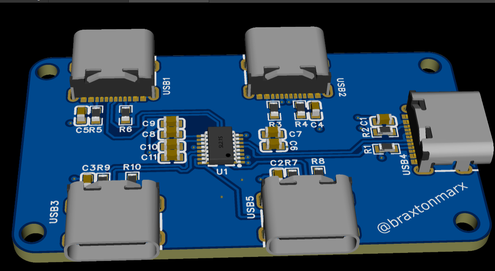
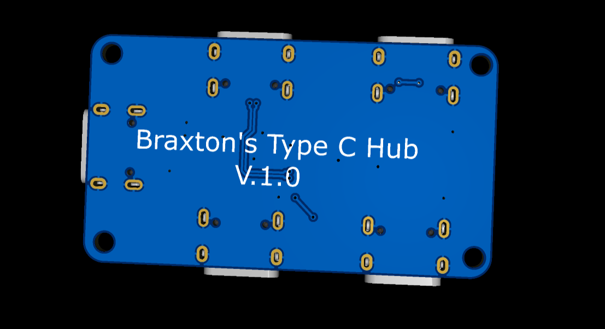
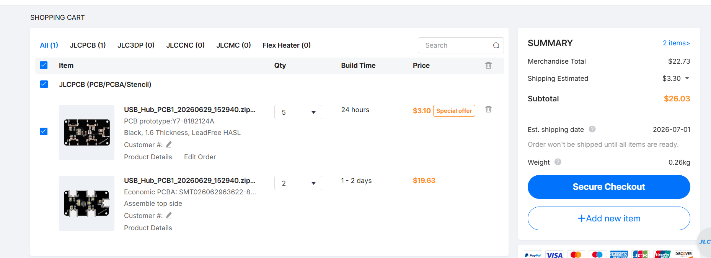

# TypeCHub - USB Type-C Hub

Easy to use USB Type-C hub! Get 3 more Type-C ports!!!

## Overview

The TypeCHub is compact to help solve the problem of port limitations on devices. You can do whatever normal typec ports do charging, transferring data, or connecting peripherals.

## Design

### PCB Layout

**Top Side:**

**Bottom Side:**

## Features

- **3 more Type-C Ports** - Get more Type-C ports so you can plug more things into your PC!
- **Plug-and-Play** - You don't need drivers to use
- **Compatibility** - Works with laptops, tablets, and other devices with USB-C ports.

## Getting Started

### Installation

1. Find an available USB Type-C port on your device
2. Plug a USB-C cable into the hub and computer
4. Then start using your 3 new Type-C ports

## Technical Specifications

| Specification | Details |
|---|---|
| **Ports** | 4x USB Type-C "(But only technically 3)|
| **Dimensions** | Compact, portable form factor |
| **Compatibility** | devices with USB Type-C |

## Usage Tips

- For optimal performance, use high-quality USB-C cables
- Ensure your device has enough power for all connected peripherals
- Keep the hub in a cool, dry location
- Avoid excessive bending of cables

## Bill of Materials

| Item | Qty | Unit Cost | Total |
|------|----:|----------:|------:|
| **USB Type-C 16-pin Connector** | 5 | $0.1613 | $0.8063 |
| **SL2.1s USB Hub Controller** | 1 | $1.2475 | $1.2475 |
| **5.1kΩ Resistors** | 10 | $0.0040 | $0.0400 |
| **100nF Capacitors** | 3 | $0.0236 | $0.0708 |
| **1µF Capacitors** | 8 | $0.0280 | $0.2240 |
| **PCB (2 assembled boards)** | 2 | $11.3650 | $22.7300 |
| **Project Total (before shipping)** | | | **$24.89** |

## Manufacturing Cost

The board was quoted through JLCPCB.

## Support

For issues or questions, please contact me

## Author

**Braxton Marx**  
 Instagram: [@BraxtonMarx](https://www.instagram.com/braxtonmarx/)  
 GitHub: [@TheRealBrax](https://github.com/TheRealBrax)

## Changelog

### Version 1.1
- Made the PCB more rounded
- Forgot to update the version # on the bottom of the PCB

### Version 1.0
- Initial release of TypeCHub
- 3 USB Type-C ports
- Full compatibility testing completed
