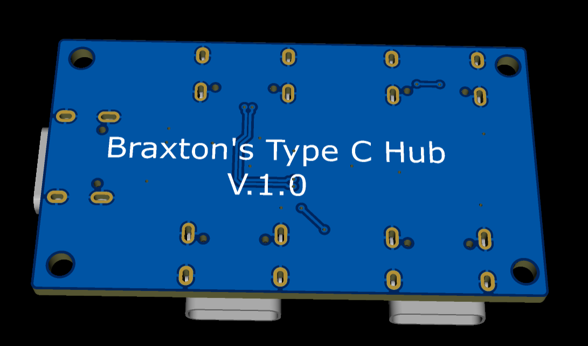

# 🔌 TypeCHub

A compact USB hub PCB designed from scratch in EasyEDA.



---

## 🚀 About

TypeCHub is a custom USB hub board designed to provide a simple and compact way to connect multiple USB devices through a single connection.

This project was designed as a hardware engineering project to learn:

- PCB Design
- USB Routing
- Schematic Design
- Manufacturing Preparation
- BOM Creation
- Hardware Documentation

---

## ✨ Features

- USB Hub IC
- USB-C Connectivity
- Compact PCB Layout
- EasyEDA Pro Design Files
- Manufacturing Ready Gerbers
- Complete BOM Included

---

## 📂 Repository Contents

| File | Description |
|--------|-------------|
| `README.md` | Project documentation |
| `image.png` | PCB preview |
| `SCH_Schematic1_2026-05-31.pdf` | Schematic PDF |
| `BOM_Board1_PCB1_2026-05-31.xlsx` | Bill of Materials |
| `PickAndPlace_PCB1_2026-05-31.xlsx` | Pick & Place file |
| `TypeCHub(Gerber).zip` | Manufacturing files |
| `ProPrj_USB Hub_2026-05-31.epro` | EasyEDA Pro project |

---

## 🛠 Manufacturing

The PCB can be manufactured using the included Gerber files:

1. Download `TypeCHub(Gerber).zip`
2. Upload to your preferred PCB manufacturer
3. Review the board preview
4. Place your order

---

## 📸 PCB Preview


---

## 📋 Bill of Materials

A complete BOM is included in:

```
BOM_Board1_PCB1_2026-05-31.xlsx
```

---

## 🧩 Assembly

A Pick & Place file is included for automated assembly:

```
PickAndPlace_PCB1_2026-05-31.xlsx
```

---

## 🎯 Project Status

🚧 In Development

Current focus:
- PCB layout refinement
- Design verification
- Prototype testing

---

## 🖥 Software Used

- EasyEDA Pro
- GitHub

---

## 📜 License

This project is open-source.

Feel free to study, modify, and improve the design.

---

## 👤 Author

Created by **Braxton (TheRealBrax)**

GitHub: https://github.com/TheRealBrax
